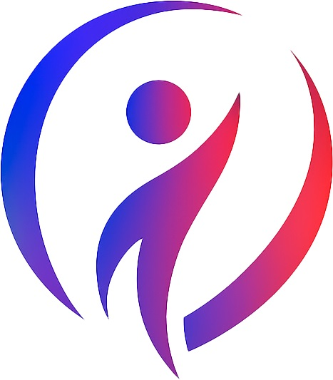
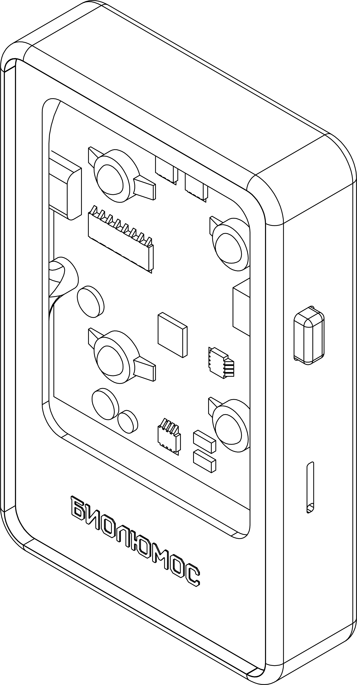
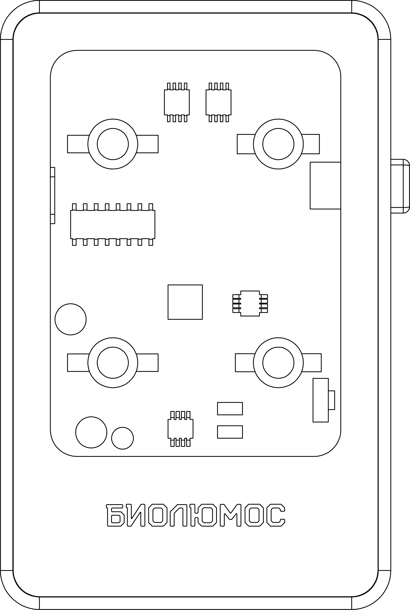
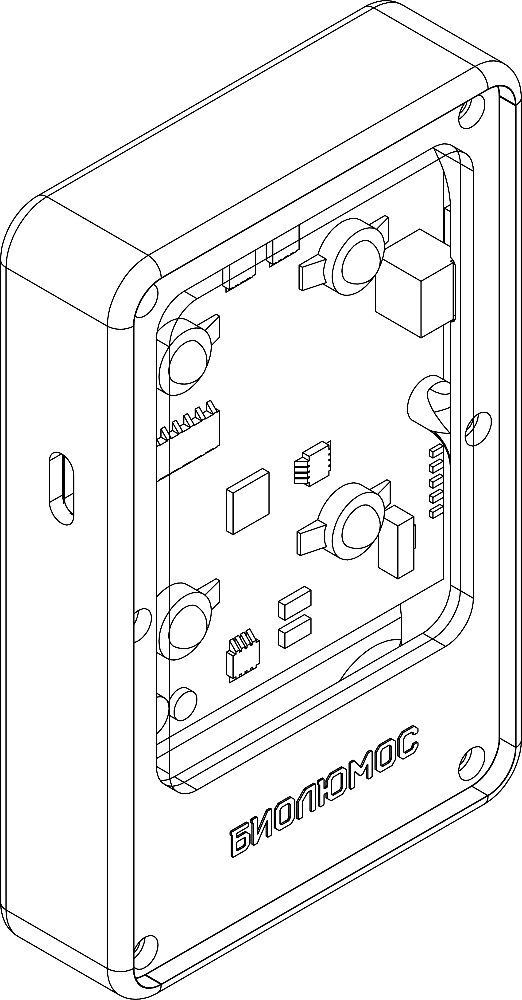
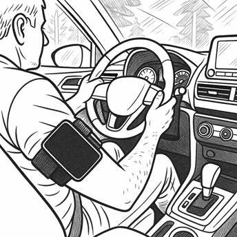
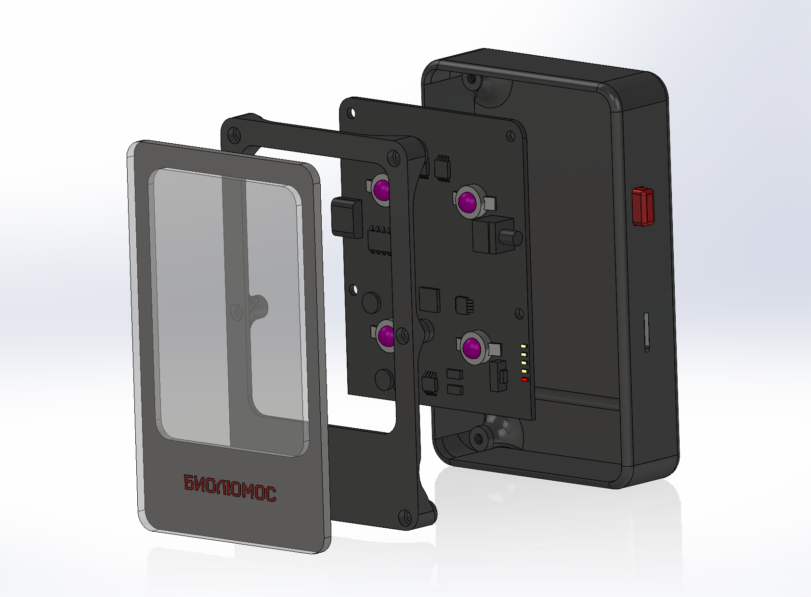
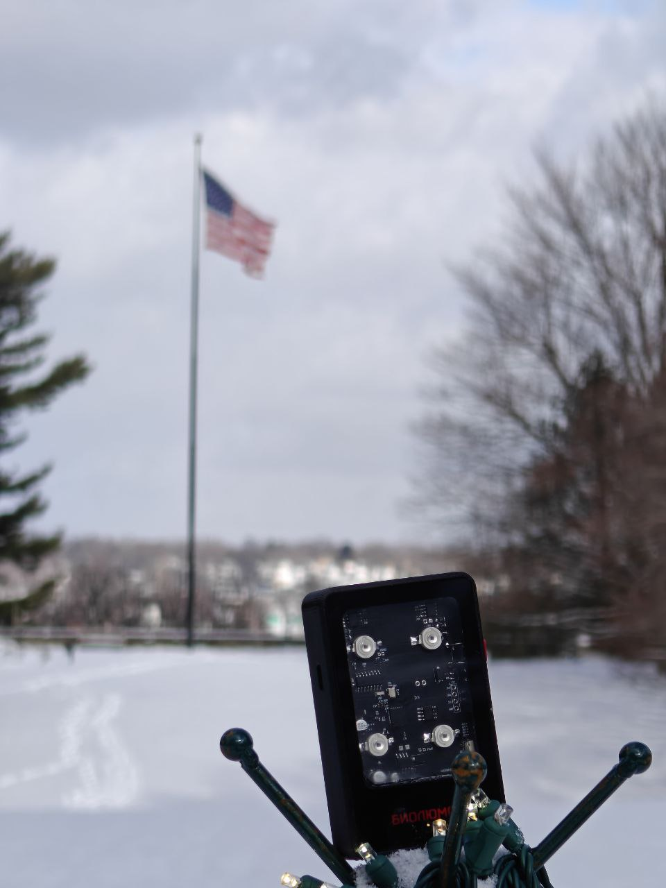
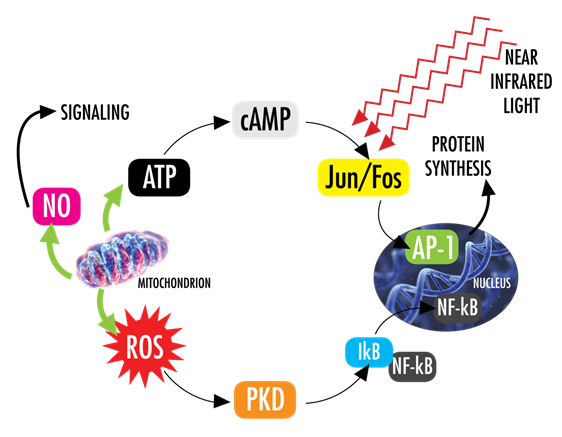

  

  <strong>⚠️ Перед использованием Biolumos проконсультируйтесь с врачом.</strong>

  <a href="README.md">English</a> |
  Русский |
  <a href="readme_es.md">Español</a>

---

# Biolumos — универсальная портативная ФБМ-платформа

Biolumos — это компактное и доступное устройство фотобиомодуляции (ФБМ), предназначенное для работы с гибкими протоколами ближнего инфракрасного света. Платформа сочетает широкие возможности настройки параметров воздействия, настоящую портативность и продуманную систему крепления на теле — всё это делает фотобиомодуляцию доступной каждому.

[Политика конфиденциальности](PRIVACY_POLICY.md#russian)

  
  
  

### Об устройстве

В основе Biolumos — четыре мощных светодиода с длиной волны 808–810 нм. Этот диапазон находится в центре современных исследований ФБМ: ближний инфракрасный свет этих длин волн особенно эффективно проникает в биологические ткани [1][2]. В отличие от большинства потребительских приборов с фиксированными режимами, Biolumos предоставляет полное управление параметрами: регулируемая мощность, длительность сеанса и частота импульсов от 1 Гц до 10 кГц, а также непрерывный режим.

Архитектура устройства поддерживает независимое управление группами светодиодов — это позволяет реализовать сложные мультичастотные протоколы, где каждая группа работает с собственными параметрами одновременно. Встроенный вибромотор может синхронизироваться с пульсацией света, выступая дополнительным тактильным индикатором в ходе сеанса.

Biolumos — это универсальная и доступная ФБМ-платформа для оздоровления, спортивного восстановления, реабилитационной поддержки и исследовательских задач.

### Возможности

- Четыре мощных светодиода с длиной волны 808–810 нм
- Регулировка мощности от 1 % до 100 %
- Настройка частоты импульсов от 1 Гц до 10 кГц
- Непрерывный режим свечения
- Независимое управление группами светодиодов
- Таймер сеанса с сохранением параметров протокола
- Беспроводное управление по Bluetooth и Wi-Fi
- Автономная работа одной кнопкой — без телефона
- Встроенный Li-ion аккумулятор — минимум два полноценных сеанса на одной зарядке
- Обновление прошивки по воздуху (OTA)

### Система крепления

Для удобного локального применения устройство размещается в мягком чехле из термопластичного полиуретана (TPU) с эластичным ремнём и застёжкой-липучкой. Такая конструкция надёжно фиксирует Biolumos практически на любом участке тела, сохраняя комфорт и свободу движений во время сеанса.

  

### Технические характеристики

  

**Расшифровка обозначений на рисунке:**

| № | Компонент |
|---|-----------|
| 1 | 4 мощных светодиода (808–810 нм) |
| 2 | Прозрачный акриловый корпус |
| 3 | Петля для крепёжного ремня |
| 4 | Мягкий чехол из термопластичного полиуретана (TPU) |
| 5 | Встроенный Li-ion аккумулятор |
| 6 | Порт USB Type-C — зарядка и обновление прошивки |
| 7 | Двухъядерный процессор |
| 8 | Модули Wi-Fi и Bluetooth |

| Параметр | Значение |
|----------|----------|
| Источник света | 4 мощных светодиода |
| Длина волны | 808–810 нм |
| Электрическая мощность светодиода | 3 Вт |
| Оптическая мощность светодиода | до 250 мВт |
| Плотность мощности | ≈ 100 мВт/см² |
| Доставляемая энергия | ≈ 1 Дж/см² за 10 с |
| Диапазон частот импульсов | 1 Гц – 10 кГц |
| Непрерывный режим | да |
| Независимая генерация частот | да |
| Регулировка мощности | 1–100 % |
| Подключение | Bluetooth, Wi-Fi |
| Мобильное приложение | Android, iOS |
| Процессор | двухъядерный контроллер |
| Порт зарядки и данных | USB Type-C |
| Аккумулятор | Li-ion (встроенный) |
| Материалы корпуса | прозрачный акрил + мягкий чехол из TPU |
| Габариты | 62,5 × 97,5 × 18 мм (2,46 × 3,84 × 0,71 дюйма) |

  

### Как работает фотобиомодуляция

Фотобиомодуляция (ФБМ) — это воздействие на клетки ближним инфракрасным светом, которое запускает естественные восстановительные процессы в организме. Когда свет с длиной волны 808–810 нм проникает в ткани, он достигает митохондрий — «энергостанций» каждой клетки. Главная мишень — фермент **цитохром c-оксидаза**, ключевое звено митохондриальной дыхательной цепи [1][2].

Это взаимодействие запускает каскад положительных клеточных реакций:

**Выработка энергии.** Поглощение света усиливает синтез аденозинтрифосфата (АТФ) — универсальной энергетической молекулы, которая обеспечивает восстановление, рост и устойчивость клеток. Когда уровень АТФ повышается, клетки быстрее восстанавливаются и эффективнее выполняют свои функции [1][2].

**Улучшение кровообращения.** ФБМ стимулирует высвобождение оксида азота (NO) — молекулы, расслабляющей стенки сосудов. В результате улучшается локальный кровоток, а ткани получают больше кислорода и питательных веществ — это поддерживает естественное восстановление организма [2][3].

**Контроль воспаления.** Исследования показывают, что ФБМ модулирует воспалительные сигнальные пути, снижает окислительный стресс и способствует переходу тканей из провоспалительного состояния в фазу восстановления. Этот механизм особенно важен при хронических или чрезмерных воспалительных процессах [3].

**Активация клеточного восстановления.** Контролируемое образование активных форм кислорода (АФК) при ФБМ активирует транскрипционные факторы NF-κB и AP-1, которые запускают гены, отвечающие за выживание, деление и восстановление клеток [1][2].

Совокупность этих механизмов делает фотобиомодуляцию одной из наиболее перспективных неинвазивных технологий биостимуляции нашего времени. Доказательная база неуклонно расширяется в самых разных направлениях — от спортивных результатов и посттренировочного восстановления [5] до реабилитации опорно-двигательного аппарата [6][7], нейробиологических задач [4] и постинсультного восстановления [8].

  

**Расшифровка обозначений на рисунке:**

| Обозначение | Полное название | Роль |
|---|---|---|
| ATP | Аденозинтрифосфат (АТФ) | Универсальная энергетическая молекула клетки |
| cAMP | Циклический аденозинмонофосфат | Вторичный внутриклеточный посредник |
| Jun / Fos | Белки Jun и Fos | Компоненты транскрипционного фактора AP-1 |
| AP-1 | Белок-активатор 1 | Транскрипционный фактор — запускает гены клеточного восстановления |
| ROS | Активные формы кислорода (АФК) | Сигнальные молекулы, запускающие механизмы восстановления при низких концентрациях |
| PKD | Протеинкиназа D | Фермент внутриклеточной передачи сигнала |
| IκB | Ингибитор NF-κB | Регуляторный белок, контролирующий активацию NF-κB |
| NF-κB | Ядерный фактор каппа-B | Транскрипционный фактор — активирует защитные гены |
| NO | Оксид азота | Вазодилататор — улучшает кровоток и доставку кислорода |

### Безопасность

- Перед началом любой программы ФБМ обязательно проконсультируйтесь с врачом.
- Не направляйте свет в глаза.
- Не используйте устройство над областями с подозрением на злокачественное новообразование без прямого разрешения врача.
- Соблюдайте особую осторожность при беременности, у детей, при повышенной фоточувствительности, лихорадке, острой инфекции и нестабильных состояниях здоровья.
- Прекратите сеанс, если усиливаются боль, раздражение кожи, головокружение или другие необычные симптомы.

По данным опубликованных исследований, ФБМ при плотности мощности ниже 100 мВт/см² считается безопасной: повышение температуры не превышает 0,38 °C на поверхности кожи головы и 0,06 °C в тканях мозга [1][4].

---

### Источники

[1] Chung H, Dai T, Sharma SK, Huang YY, Carroll JD, Hamblin MR. The nuts and bolts of low-level laser (light) therapy. *Annals of Biomedical Engineering*. 2012;40(2):516–533. DOI: [10.1007/s10439-011-0454-7](https://doi.org/10.1007/s10439-011-0454-7)

[2] de Freitas LF, Hamblin MR. Proposed Mechanisms of Photobiomodulation or Low-Level Light Therapy. *IEEE Journal of Selected Topics in Quantum Electronics*. 2016;22(3):7000417. DOI: [10.1109/JSTQE.2016.2561201](https://doi.org/10.1109/JSTQE.2016.2561201)

[3] Hamblin MR. Mechanisms and applications of the anti-inflammatory effects of photobiomodulation. *AIMS Biophysics*. 2017;4(3):337–361. DOI: [10.3934/biophy.2017.3.337](https://doi.org/10.3934/biophy.2017.3.337)

[4] Hamblin MR. Shining light on the head: Photobiomodulation for brain disorders. *BBA Clinical*. 2016;6:113–124. DOI: [10.1016/j.bbacli.2016.09.002](https://doi.org/10.1016/j.bbacli.2016.09.002)

[5] Ailioaie LM, Litscher G. Photobiomodulation and Sports: Results of a Narrative Review. *Life (Basel)*. 2021;11(12):1339. DOI: [10.3390/life11121339](https://doi.org/10.3390/life11121339)

[6] Huang Z, Ma J, Chen J, Shen B, Pei F, Kraus VB. The effectiveness of low-level laser therapy for nonspecific chronic low back pain: a systematic review and meta-analysis. *Arthritis Research and Therapy*. 2015;17:360. DOI: [10.1186/s13075-015-0882-0](https://doi.org/10.1186/s13075-015-0882-0)

[7] Naterstad IF, Joensen J, Bjordal JM, et al. Efficacy of low-level laser therapy in patients with lower extremity tendinopathy or plantar fasciitis: systematic review and meta-analysis of randomised controlled trials. *BMJ Open*. 2022;12:e059479. DOI: [10.1136/bmjopen-2021-059479](https://doi.org/10.1136/bmjopen-2021-059479)

[8] Paolillo FR, Luccas GAA, Parizotto NA, et al. The effects of transcranial laser photobiomodulation and neuromuscular electrical stimulation in post-stroke recovery. *Journal of Biophotonics*. 2023;16(4):e202200260. DOI: [10.1002/jbio.202200260](https://doi.org/10.1002/jbio.202200260)

  

